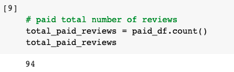
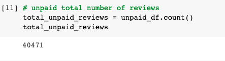
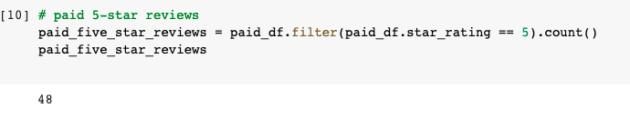
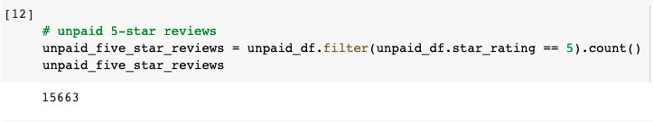
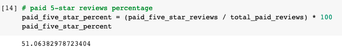
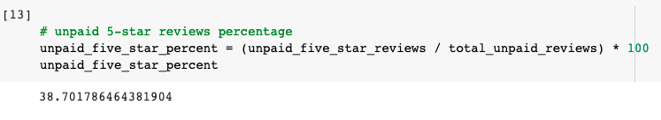

# Amazon_Vine_Analysis

## Overview
This project analyzes Amazon Vine program to determine if there is a bias toward favorable reviews from Vine members.
The analysis uses PySpark to perform the ETL process to extract the dataset, transform the data, connect to an AWS RDS instance, load the transformed data into pgAdmin and calculate different metrics.  The focus for this analysis was for US reviews on video games. 

## Results
### Total number of reviews

~Vine reviews

              
              
~Non-Vine reviews

   
              
              
### Total number of 5 star reviews
~Vine reviews

   
              
              
~Non-Vine reviews

   
              
              
### Percentage of 5 star reviews
~Vine reviews

   
              
              
~Non-Vine reviews

   
              
              
## Summary
51% of the reviews in the Vine program were 5 stars reviews whereas the percentage in the non-Vine reviews is only 39%. This describes a positivity bias for reviews in the Vine program.
Additionally we could analyse the statistical distribution (mean, median and mode) of the star rating for the Vine and non-Vine reviews.
